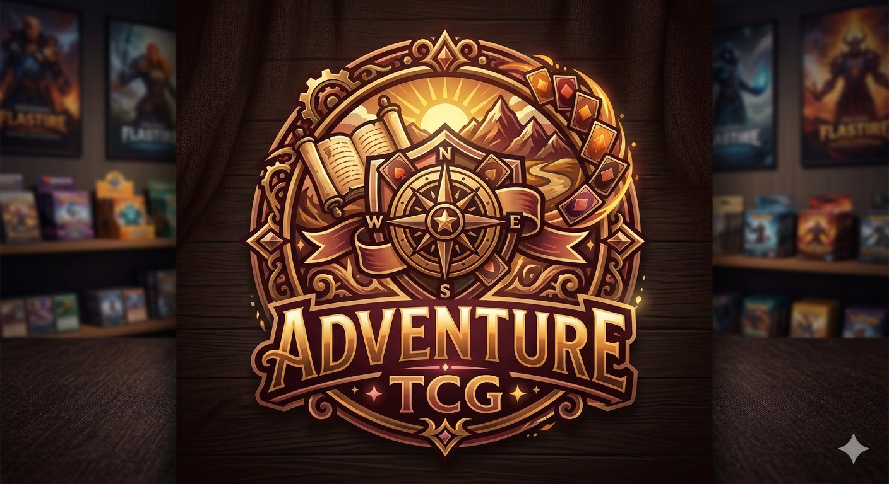

# Adventure TCG - Tienda Online de Cartas Coleccionables



E-commerce de Trading Card Games (TCG) para comprar cartas coleccionables, productos sellados y accesorios de múltiples juegos.

## Juegos TCG Soportados

| Juego | Color | ID |
|-------|-------|-----|
| Pokemon TCG | #ef4444 | `pokemon` |
| Yu-Gi-Oh! | #f59e0b | `yugioh` |
| Magic: The Gathering | #3b82f6 | `magic` |
| Digimon | #8b5cf6 | `digimon` |
| One Piece | #dc2626 | `onepiece` |
| Dragon Ball | #f97316 | `dragonball` |
| Lorcana | #ec4899 | `lorcana` |

## Stack Tecnológico

### Core
- **React** 19.2.0
- **React Router DOM** 7.13.1
- **Vite** 7.3.1

### UI/UX
- **Lucide React** - Iconos
- **Leaflet** + **React Leaflet** - Mapas

### Backend/Storage
- **Firebase** 12.10.0 - Configurado (pendiente de activar)
- **localStorage** - Almacenamiento actual

### SEO
- **React Helmet Async** - Meta tags

### Testing
- **Vitest** + **React Testing Library**

## Estructura del Proyecto

```
tcg/
├── public/
│   ├── Adventure.jpeg             # Logo
│   └── .htaccess                 # Config Apache
├── scripts/
│   └── seedCards.js              # Script para poblar datos
├── src/
│   ├── assets/                   # Recursos estáticos
│   ├── components/               # Componentes reutilizables
│   │   ├── CartButton.jsx        # Botón agregar al carrito
│   │   ├── CartDrawer.jsx        # Panel deslizable del carrito
│   │   ├── CardGrid.jsx         # Grid de cartas con filtros
│   │   ├── CheckoutForm.jsx     # Formulario de envío
│   │   ├── Footer.jsx           # Pie de página
│   │   ├── GameFilter.jsx       # Filtro por juego TCG
│   │   ├── ImageUploader.jsx     # Carga de imágenes
│   │   ├── LocationMap.jsx       # Mapa de ubicación
│   │   ├── Navbar.jsx           # Navegación principal
│   │   ├── PayPalButton.jsx     # Integración PayPal
│   │   ├── ProductCard.jsx       # Tarjeta de producto
│   │   ├── ScrollToTop.jsx      # Botón scroll arriba
│   │   ├── SEO.jsx              # Meta tags
│   │   ├── Toast.jsx            # Notificaciones
│   │   └── WhatsAppButton.jsx   # Botón WhatsApp flotante
│   ├── context/                 # Estado global
│   │   ├── CartContext.jsx      # Carrito de compras
│   │   ├── OrderContext.jsx     # Pedidos
│   │   ├── SiteContext.jsx      # Configuración del sitio
│   │   ├── UserContext.jsx      # Usuario
│   │   └── WishlistContext.jsx  # Lista de deseos
│   ├── data/
│   │   └── sampleData.json      # Datos de ejemplo
│   ├── pages/                   # Páginas/rutas
│   ├── services/                # Servicios externos
│   │   ├── api.js               # API placeholder
│   │   └── paypalService.js     # Servicio PayPal
│   ├── test/                    # Tests
│   ├── App.css                  # Estilos globales
│   ├── App.jsx                  # Componente principal
│   ├── index.css                # Estilos base (4327 líneas)
│   └── main.jsx                 # Entry point
├── .env.example                 # Variables de entorno
├── firebase.rules               # Reglas Firebase
├── package.json
├── vite.config.js
└── vitest.config.js
```

## Páginas

| Ruta | Descripción |
|------|-------------|
| `/` | Home con carousel, categorías, ofertas |
| `/catalogo` | Catálogo de cartas sueltas con filtros |
| `/productos` | Productos sellados (boosters, ETBs, decks) |
| `/producto/:id` | Detalle de producto |
| `/carrito` | Carrito de compras |
| `/checkout` | Proceso de compra con PayPal |
| `/mis-pedidos/:orderId` | Seguimiento de pedido |
| `/mis-deseos` | Lista de favoritos |
| `/admin` | Panel de administración completo |
| `/contacto` | Página de contacto con mapa |

## Instalación

```bash
# Clonar repositorio
git clone https://github.com/gapman20/tcg.git
cd tcg

# Instalar dependencias
npm install

# Crear archivo .env desde el ejemplo
cp .env.example .env

# Iniciar servidor de desarrollo
npm run dev
```

## Variables de Entorno

Crear archivo `.env` basado en `.env.example`:

```env
VITE_PAYPAL_CLIENT_ID=tu_client_id_de_paypal
```

## Panel de Administración

Acceso: `/admin`

**Credenciales por defecto:**
- Usuario: `admin`
- Contraseña: `admin123`

El panel incluye:
- Dashboard con estadísticas
- CRUD completo de productos
- Gestión de órdenes
- Configuración del sitio

## Almacenamiento

Actualmente el proyecto usa **localStorage** para persistencia local.

**Claves usadas:**
| Clave | Datos |
|-------|-------|
| `site_*_v1` | Configuración del sitio |
| `tcg_cart` | Carrito de compras |
| `tcg_orders` | Pedidos |
| `tcg_user` | Usuario |
| `tcg_wishlist` | Lista de deseos |

### Migración a Firebase (pendiente)

El proyecto tiene Firebase configurado en `src/firebase.js` pero no está activo. Para activar:

1. Crear proyecto en Firebase Console
2. Habilitar Authentication y Firestore
3. Actualizar credenciales en `.env`
4. Descomentar la integración en los contextos

## Convenciones de Código

- **Componentes**: PascalCase (`ProductCard.jsx`)
- **Hooks**: `use` prefix (`useCart`)
- **Estilos**: CSS Variables + clases utilitarias
- **Patrón Provider**: Todos los contextos usan `createContext`

## Próximos Pasos

### Técnicos
- [ ] Migrar a TypeScript
- [ ] Integrar backend real (Firebase)
- [ ] PWA con service worker
- [ ] Aumentar cobertura de tests

### Negocio
- [ ] Pasarelas de pago adicionales (Stripe)
- [ ] Sistema de cupones/descuentos
- [ ] Programa de lealtad
- [ ] Chat en vivo
- [ ] Toggle Dark/Light mode

## Licencia

Privado - Todos los derechos reservados
